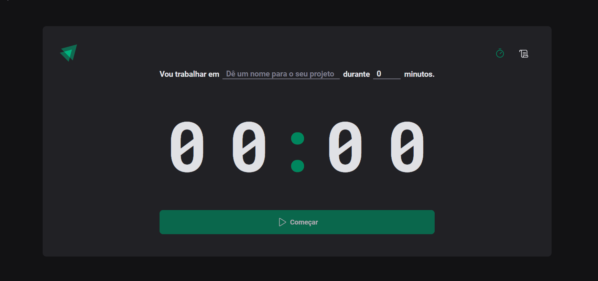

## 💻 Sobre o projeto

Timer - esse webApp fornece um contador de minutos para projetos/tarefas criando um histórico com o status e tempo decorrido de cada projeto. O desafio na contrução de um Timer é dominar o ciclo de vida dos componentes (useEffect) garantindo o funcionamento, integridade e o gerenciamento das renderizações. Clique no link abaixo para conferir o deploy da aplicação!

<a href="https://vanor-cardozo.github.io/timer-project/">acessar webApp</a>

## ⚙️ Funcionalidades

    - Adicionar um projeto/tarefa 
    - Selecionar um período para conclusão (minutos)
    - Histórico dos projetos
  
## 🛠 Tecnologias

- [x] WebApp (React + TypeScript)
    - Styled components (CSS)
    - Phospor
    - Zod (validação dos formulários)
    - Date fns (formatação para data/tempo)
    - ESLint
  
---

    

